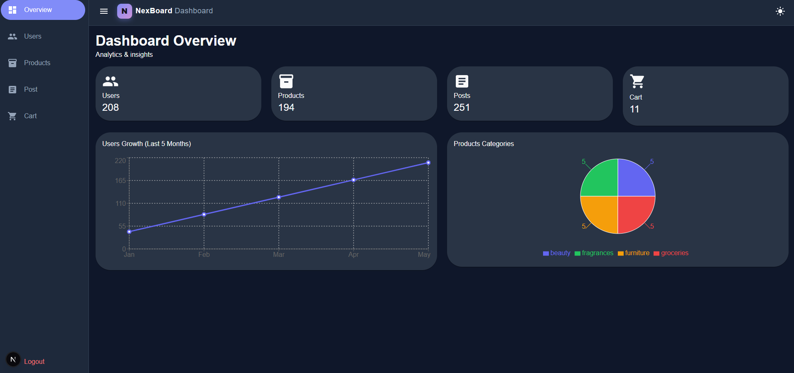
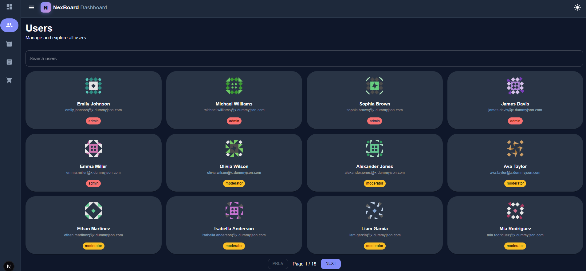
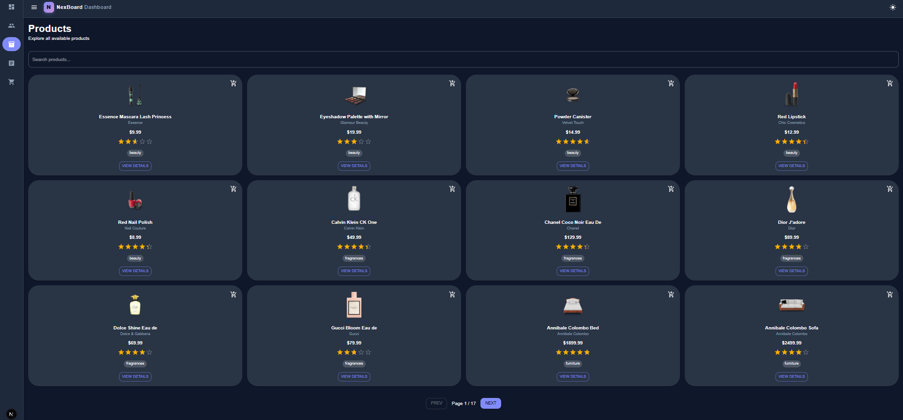
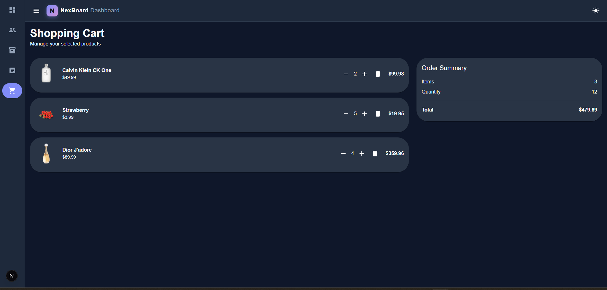
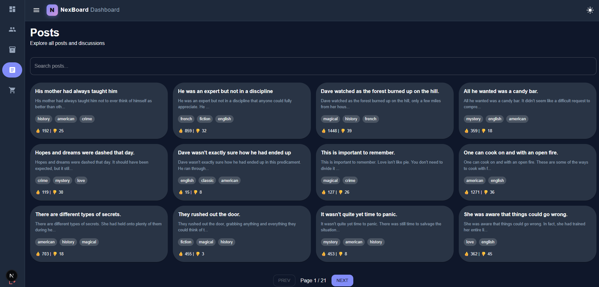

# 🚀 SaaS Dashboard (Next.js + Redux Toolkit)

## 📌 Overview

A modern, fully responsive SaaS dashboard built with **Next.js App Router**, **Redux Toolkit**, and **Material UI**.
It demonstrates real-world dashboard patterns including authentication, data management, analytics, and UI theming.

---

## ✨ Features

* 🔐 Authentication system (Login + Protected Routes)
* 👥 Users management with search & pagination
* 📦 Products system with cart functionality
* 🛒 Shopping cart with local persistence
* 📝 Posts & comments system
* 📊 Analytics dashboard (charts & KPIs)
* 🌙 Dark / Light mode (Theme toggle)
* ⚡ Fully responsive design
* 🎯 Clean UI using Material UI (MUI)

---

## 🧠 Tech Stack

| Technology           | Usage                    |
| -------------------- | ------------------------ |
| Next.js (App Router) | Routing & SSR/CSR hybrid |
| TypeScript           | Type safety              |
| Redux Toolkit        | Global state management  |
| Material UI (MUI)    | UI components & styling  |
| Recharts             | Charts & analytics       |
| DummyJSON API        | Mock backend data        |

---

## 📸 Screenshots

### 🏠 Dashboard



### 👥 Users



### 📦 Products



### 🛒 Cart



### 📝 Posts



---

## 🚀 Live Demo

[](https://saas-analytics-dashboard-kappa.vercel.app/)

---

## ⚙️ Installation

```bash
git clone https://github.com/your-username/your-repo.git
cd your-repo
npm install
npm run dev
```

---

## 📁 Project Structure

```
src/
 ├── app/
 │   ├── (Dashboard)/
 │   ├── login/
 │   └── layout.tsx
 ├── components/
 ├── features/ (Redux slices)
 ├── store/
 └── AppTheme/
 └── GlopalTypes/
```

---

## 🎨 UI Highlights

* Built with **MUI + sx system**
* Consistent spacing & layout
* Smooth hover & interaction states
* Reusable components

---

## 🧑‍💻 Author

**Nadeem**
Frontend Developer 🚀

---

## ⭐ Notes

This project is built as a **real-world dashboard simulation**
and demonstrates scalable architecture using modern React tools.
